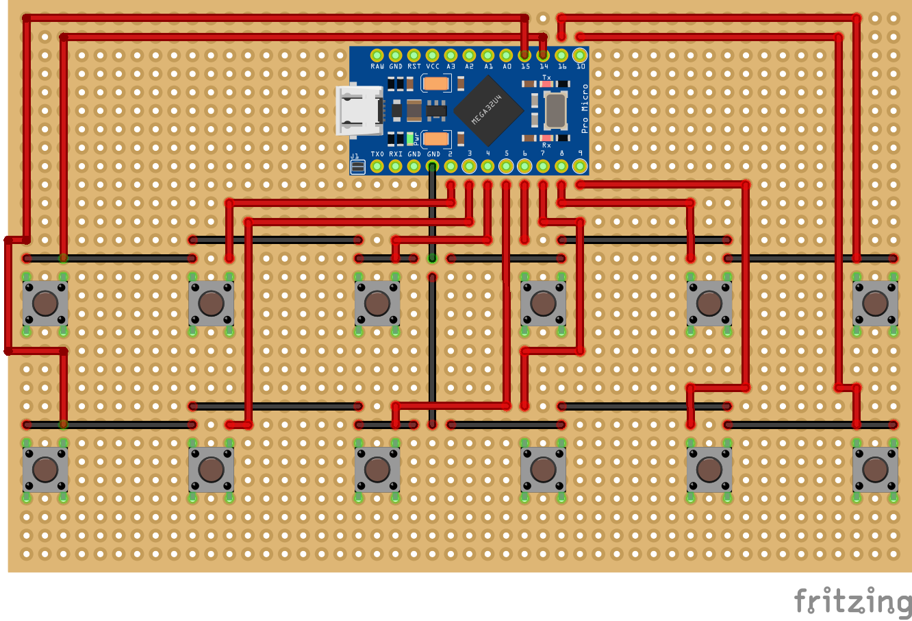
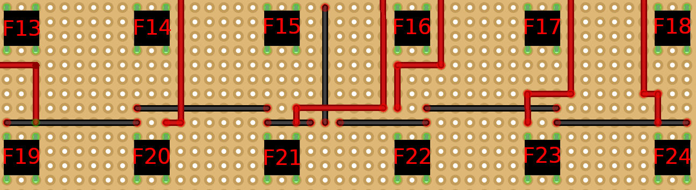

# StreamKeypad

A minimal keypad able to send keys from F13 to F24

## The wiring 

The current version is built with an Arduino Pro Micro but can be adapted to every arduino board with USB capabilities.

The twelves buttons are binded as follow : 

